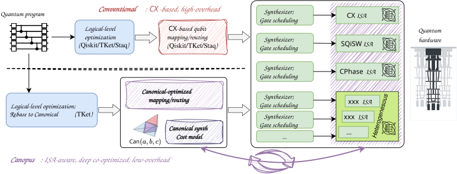

# 🧭 Canopus: Canonical-Optimized Placement Utility Suite for Quantum Compilation

[](https://pypi.org/project/canopus-quantum/) [](./LICENSE) [](https://github.com/Youngcius/canopus/actions/workflows/ci.yml) [](https://pypi.org/project/canopus-quantum/) [](https://arxiv.org/abs/2511.04608)


**Canopus** (**Can**onical-**O**ptimized **P**lacement **U**tility **S**uite) is a qubit mapping/routing framework tailored to advanced quantum ISAs. Its main function is to optimize the layout and routing of qubits on quantum hardware, handling optimal synthesis with diverse ISAs in a unified approach through two-qubit canonical gate representation, providing guidance for hardware-software co-design.


> ***Canopus** evokes the name of the second-brightest star in the sky, symbolizing its role as a "navigational" guide for routing qubits through the complex constraints of quantum hardware.*




## Installation

### Prerequisite: `monodromy` (+ `lrslib`)

Canopus depends on the [`monodromy`](https://github.com/Youngcius/monodromy) library for Weyl-chamber coverage computation. `monodromy` is **not** on PyPI and must be installed manually **before** `pip install canopus-quantum`:

```bash
pip install git+https://github.com/Youngcius/monodromy
```

`monodromy` itself needs the `lrs` binary from [lrslib](http://cgm.cs.mcgill.ca/~avis/C/lrs.html). Platform-specific setup:

<details>
<summary><b>macOS</b></summary>

```bash
brew install gmp
cd lrslib-073 && make
sudo make install
```
</details>

<details>
<summary><b>Ubuntu / Debian</b></summary>

```bash
sudo apt update && sudo apt install -y build-essential libgmp-dev
cd lrslib-073 && make
sudo make install
```
</details>

<details>
<summary><b>Conda (any OS)</b></summary>

```bash
conda install -c conda-forge gmp
cd lrslib-073
make INCLUDEDIR="$CONDA_PREFIX/include" LIBDIR="$CONDA_PREFIX/lib"
make prefix=$HOME/.local install
echo 'export PATH="$HOME/.local/bin:$PATH"' >> ~/.bashrc && source ~/.bashrc
```
</details>

### From PyPI (recommended)

```bash
pip install canopus-quantum
```

Pre-compiled wheels are published for Linux and macOS on Python 3.10 – 3.13. No Rust toolchain is required for this path.

> The distribution name on PyPI is `canopus-quantum`; the import name remains `canopus`:
> ```python
> import canopus
> ```

### From source

```bash
git clone https://github.com/Youngcius/canopus.git
cd canopus
pip install .
```

`pip install .` runs the [maturin](https://github.com/PyO3/maturin) build backend in an isolated environment, which:
1. Compiles the Rust extension (`canopus.utils._accel`) for the active Python version,
2. Packages the Python sources, and
3. Installs the resulting wheel into the current environment.

**Prerequisite for source builds**: a working Rust toolchain. Install via [rustup](https://rustup.rs):

```bash
curl --proto '=https' --tlsv1.2 -sSf https://sh.rustup.rs | sh
```


## Usage

More end-to-end examples live under [`./examples/`](./examples/):

- [`routing.ipynb`](./examples/routing.ipynb) — Canopus routing in detail
- [`rebasing.ipynb`](./examples/rebasing.ipynb) — Optimal ISA rebase (`B` gate, `√iSWAP`, arbitrary)
- `python route_demo.py` to test the routing effect by Sabre and Canopus on a demo circuit
- `python route_qft.py <n>` — Compare Canopus vs Sabre routing on an `n`-qubit QFT
- `python rebase_xxx.py` to test the rebase passes for arbitrary ISAs


## Package layout

```text
canopus/                            # Python package
├── __init__.py
├── backends.py                     # Backend / ISA / cost-estimator definitions
├── basics.py                       # CanonicalGate, BGate, SQiSWGate
├── mapping.py                      # CanopusMapping & SabreMapping transpiler passes
├── synthesis.py                    # rebase_to_{canonical, sqisw, zzphase, custom, ...}
├── decomposition/                  # Two-qubit decomposition kernels
├── extensions/                     # Optional integrations (bqskit, ...)
└── utils/
    ├── _core.py                    # Pure-Python utilities
    ├── _accel.cpython-*.so         # Rust-compiled accelerator (built by maturin)
    └── _accel.pyi                  # Type stubs for the Rust extension

src/                                # Rust source for the accelerator
└── lib.rs                          # PyO3 bindings
```


## Development

Install the dev extras and build the Rust extension in editable mode:

```bash
pip install -e ".[dev]"
poe dev          # equivalent to: maturin develop --release
```

Common tasks (defined in `pyproject.toml`):

| Command         | Description                                                  |
|-----------------|--------------------------------------------------------------|
| `poe dev`       | Build & install the Rust extension in editable mode          |
| `poe rebuild`   | Clean and rebuild from scratch                               |
| `poe build`     | Build a redistributable wheel into `./target/wheels/`        |
| `poe clean`     | Remove every compiled artifact and cache                     |
| `poe lint`      | `ruff check canopus`                                         |
| `poe fmt`       | `ruff format canopus`                                        |
| `poe fmt-check` | `ruff format --check canopus`                                |
| `poe typecheck` | `mypy canopus`                                               |
| `poe test`      | `pytest`                                                     |
| `poe check`     | Aggregate gate that CI runs: lint + fmt-check + test         |

See [CONTRIBUTING.md](./CONTRIBUTING.md) for the full contribution workflow.


## Evaluation artifact

[`./experiments/`](./experiments/) contains the full evaluation suite that accompanies the paper.

### Case studies

- [`./experiments/eval_qft/`](./experiments/eval_qft/) — QFT kernel
- [`./experiments/eval_qldpc/`](./experiments/eval_qldpc/) — QLDPC stabilizer circuits

### Benchmark suite

Evaluation commands are managed via [`./experiments/Makefile`](./experiments/Makefile). First prepare prerequisite files (coupling files, coverage sets, logical-level optimized circuits):

```bash
cd experiments && make
```

Then:

- `make canopus` — evaluate Canopus
- `make baselines` — evaluate baseline compilers (Sabre, TOQM, BQSKit)
- `make sum_result` — summarize results once routing evaluation completes
- `make disp_result` — display summarized routing overheads across compilers, topologies, and ISAs

For fine-grained evaluation, you may also run `bench_all.py`, `bench_all_toqm.py`, etc. directly.


## Citation

If you use Canopus in your work, please cite:

```bibtex
@article{yang2025unifying,
  title   = {Unifying Qubit Routing Across Diverse Quantum ISAs via Canonical Representation},
  author  = {Yang, Zhaohui and Zhang, Kai and Tian, Xinyang and Ren, Xiangyu and
             Liu, Yingjian and Li, Yunfeng and Ding, Dawei and Chen, Jianxin and Xie, Yuan},
  journal = {arXiv preprint arXiv:2511.04608},
  year    = {2025}
}
```


## License

This project is licensed under the Apache License 2.0 — see the [LICENSE](LICENSE) file for details.
